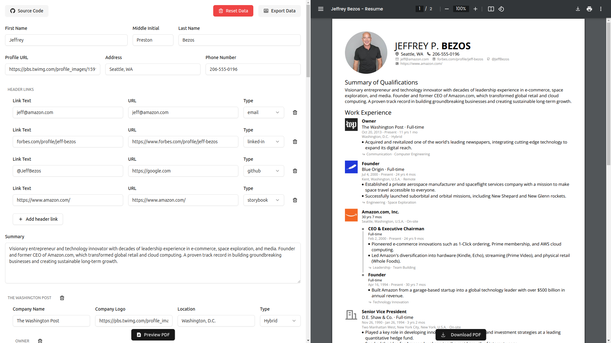
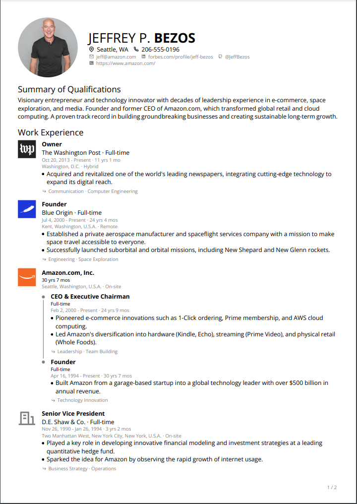
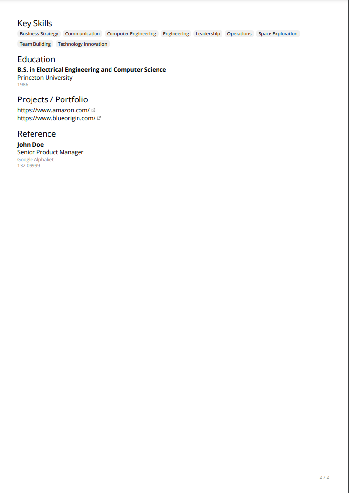

# React PDF Resume Builder

React PDF Resume Builder is a powerful tool for generating professional resumes in PDF format using React and TypeScript. The current design emulates the sleek style of a LinkedIn profile, providing a clean and modern look.

This application utilizes `localStorage` to save user data, with plans to migrate to **Dexie.js** in the next release, enabling support for multiple resume designs.

---

## Features

- **LinkedIn-like Resume Design**: A clean and professional template for your resume.
- **Real-time Preview**: Instantly see changes as you build your resume.
- **PDF Export**: Generate and download your resume as a PDF.
- **Data Persistence**: Automatically saves progress in `localStorage`.
- **Planned Enhancements**: Support for multiple designs using Dexie.js.

---

## Tech Stack

- **[Vite](https://vitejs.dev/)**: A fast and lightweight build tool.
- **[React](https://reactjs.org/)**: A JavaScript library for building user interfaces.
- **[TypeScript](https://www.typescriptlang.org/)**: For type-safe development.
- **[@react-pdf/renderer](https://react-pdf.org/)**: To create PDF documents in React.
- **[react-hook-form](https://react-hook-form.com/)**: Simplifies form handling with React.

---

## Installation

1. Clone the repository:

   ```bash
   git clone https://github.com/stonix26/react-pdf-resume.git
   cd react-pdf-resume
   ```

2. Install dependencies using PNPM:

   ```bash
   pnpm install
   ```

3. Start the development server:

   ```bash
   pnpm dev
   ```

4. Open your browser and navigate to:

   ```bash
   http://localhost:5173
   ```

## Building for Production

To build the app for production, run:

```bash
pnpm build
```

This will create an optimized build in the `dist/` directory.

## Usage

Fill in your personal and professional details in the form fields.
Preview your resume in real-time.
Click "Download PDF" to export your resume.

## Planned Features

- **Multiple Resume Designs**: Create resumes with different templates.
- **Enhanced Storage**: Switch from localStorage to IndexedDB using Dexie.js for better flexibility and scalability.
- **Customizable Templates**: Fine-tune colors, fonts, and layouts.

## Screenshots







## Contributing

Contributions are welcome! Feel free to submit issues or pull requests to help improve this project.

## License

This project is licensed under the [MIT License](./LICENSE).

## Acknowledgements

- Thanks to the developers of `@react-pdf/renderer`, `zod`, and `react-hook-form` for simplifying PDF generation and form management.

---

Start building your professional resume today! 🚀
